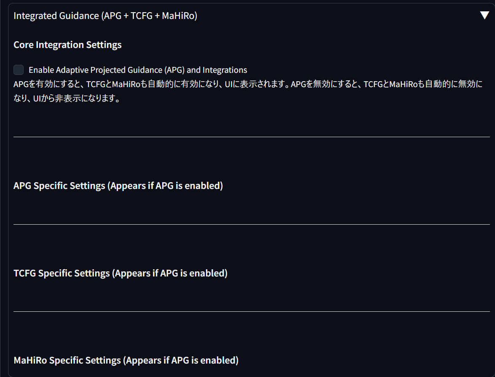
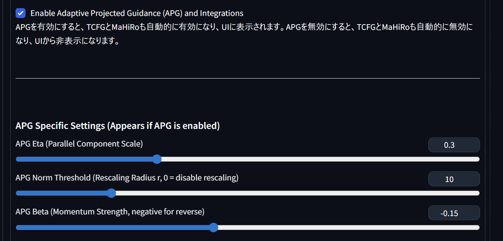

# TCFG-APG-Mahiro-for-ForgeClassic

This repository is implementation of TCFG and APG and Mahiro for Forge Classic

TCFG and Mahiro function automatically when APG is turned on.

Combined use of FBCache causes artifacts in the image.

It can be used in combination with FreeU.


## how to install

Place this repository in your Forge classic extensions directory:

```
cd /path/to/Stable Diffusion WebUI Forge - Classic\extensions

git clone https://github.com/Shiba-2-shiba/TCFG-APG-Mahiro-for-ForgeClassic.git

```
## Tab




## Enabked APG value



